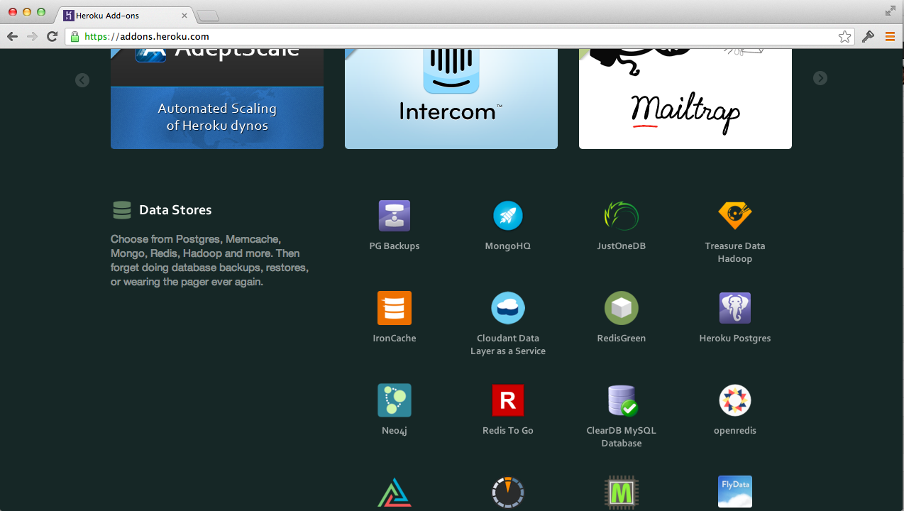

# Lab #3

## Introduction 

In Lab #3, you'll get to know the `heroku` command line client a bit better. Then we'll see a few nifty add-ons. 

Add-ons are 3rd party libraries, utilities, and services that are made available to you via the Heroku platform.

#### Logging 

First and foremost, it helps to see what your app is doing up in the cloud. Logs help here and the `heroku` command line client easily allows you to see logs in real-time with the following command: 

```
$> heroku logs -t
```

The `-t` flag is for tail. You can also specify how many lines of logs you'd like to see via the `-n` flag. Go ahead and type 

```
$> heroku help logs
```

to see more options w/r to logs in Heroku. 

#### Scaling

Naturally, the cloud rocks because you can easily scale your apps. And, of course, you can do this on-demand. You pay for what you use -- scale things up, you pay more, scale things down, you pay less. Easy. 

Scaling in Heroku is done via the `ps` command. Go ahead and type:  

```
$> heroku ps
=== web (1X): `coffee App.coffee`
web.1: up 2013/08/06 15:09:24 (~ 10m ago)
```

You should see some basic information on your app -- in this case, you have 1 web dyno running your app. In Heroku, you get one dyno for free -- this dyno has 512MB of memory allocated to it. Heroku [offers 1GB dynos](https://blog.heroku.com/archives/2013/4/5/2x-dynos-beta) as well, however, they are not free. 

If you'd like to add more dynos (i.e. scale up your app), you specify how many dynos you'd like. For example, if I'd like 2 dynos, I'd type:

```
$> heroku ps:scale web=2
```

Feel free to do this yourself, but be aware: adding more than 1 dyno incurs a charge! You won't break the bank, however. 

While we're on the subject of web dynos, be aware that Heroku also offers background dynos called worker dynos. This is an advanced subject for another workshop; nonetheless, these dynos are priced similarly.


```
$> heroku config help
```

```
$> heroku maintenance help
```

```
$> heroku status
```

```
$> heroku help certs
```

 

